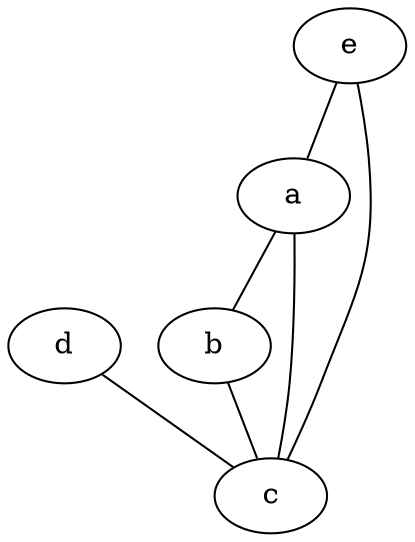
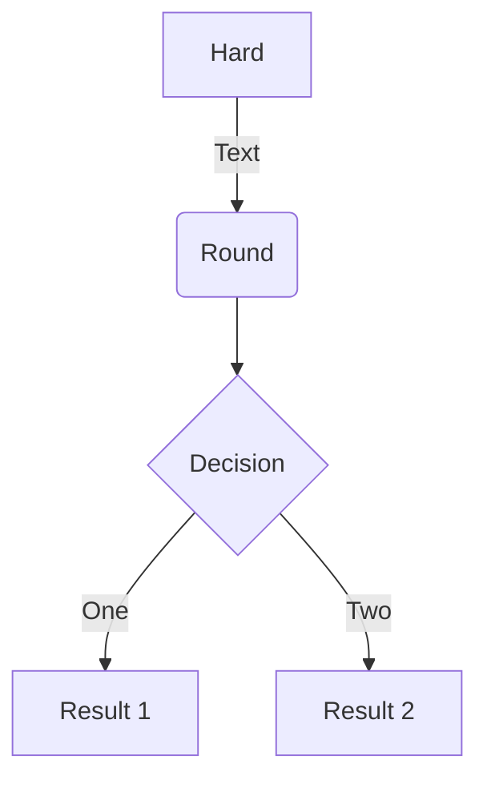
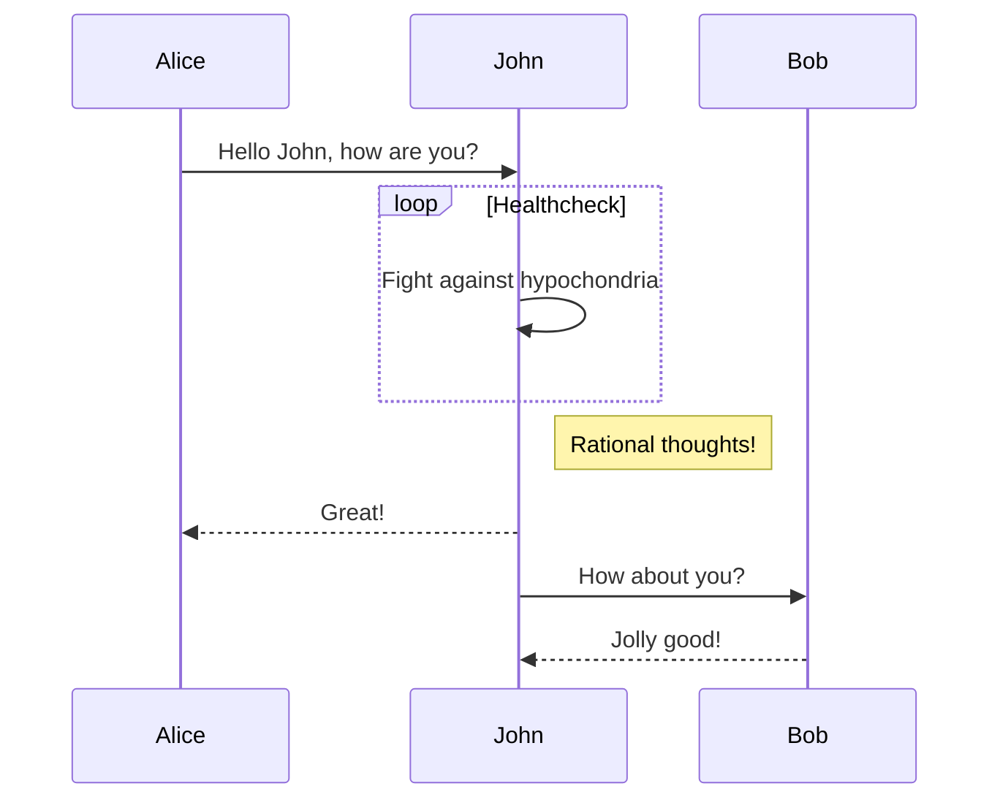

You can put mermaidjs and graphviz diagrams in your markdown!

Code like:
~~~markdown

~~~

(you can use three backticks or three ~s - either works - I'm using both to make this page work!)

Results in:

Similarly for mermaid.js (a JavaScript tool a bit like Plantuml):

